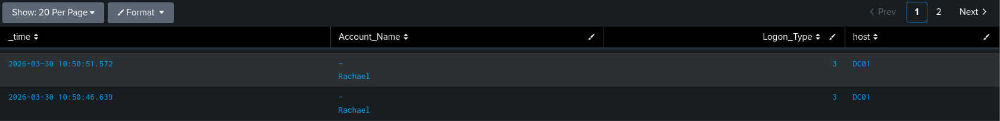

# Lateral Movement Detection

## Description
Detects remote logons to Windows machines as part of lateral movement.  
Event Codes: 4624 (remote login) with LogonType 3 (network logon)

## Screenshot



## Splunk Detection Query

```spl
index=winevents EventCode=4624 | table _time, Account_Name, Login_Type=3, host
