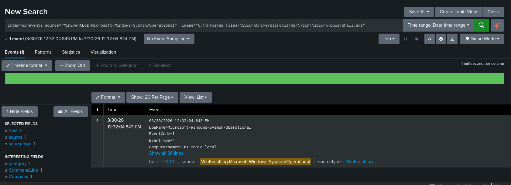

# PowerShell Sysmon Detection

## Description
This detection demonstrates how **Sysmon Operational logs** capture PowerShell activity in a Windows environment.  
The lab activity involved manually running PowerShell scripts using `splunk-powershell.exe`.

**Captured Event Codes:**  
- EventCode 1 → Process creation  
- EventCode 4 → Script execution  

## Screenshot



## Splunk Detection Query

```spl
index=winevents sourcetype="WinEventLog:Microsoft-Windows-Sysmon/Operational"
image="C:\\Program Files\\SplunkUniversalForwarder\\bin\\splunk-powershell.exe"
(EventCode=1 OR EventCode=4)
